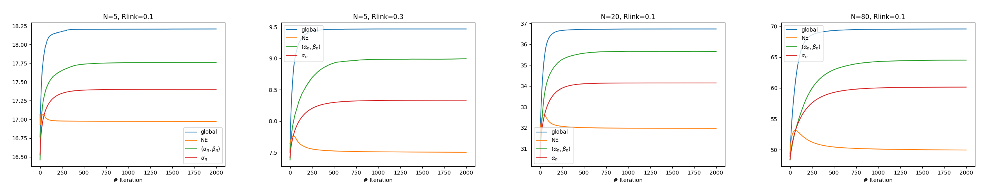
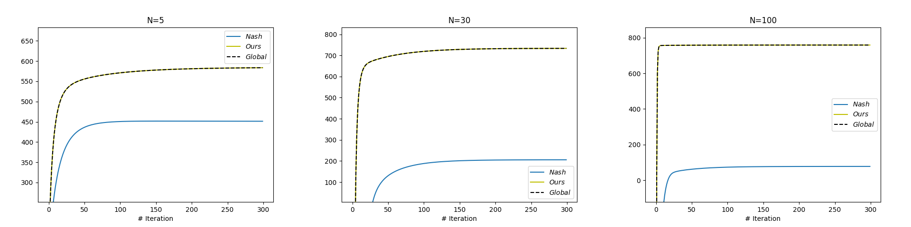
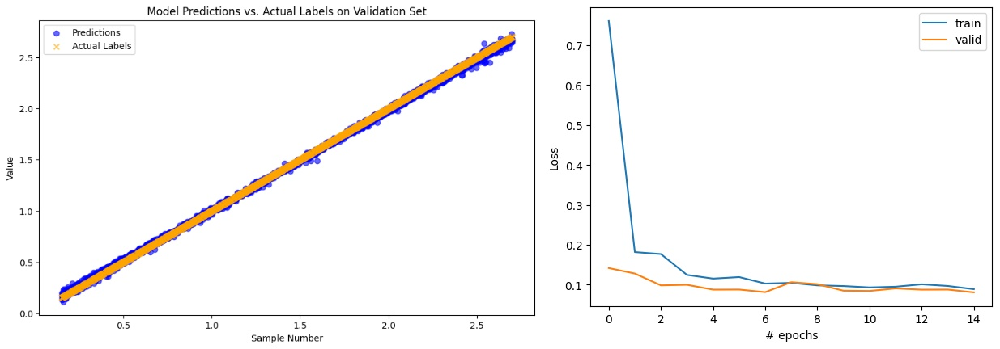

# Up Your Game: Training Games with Efficient Nash Equilibrium with Deep Learning
A code implementation of Up Your Game: Training Games with Efficient Nash Equilibrium with Deep Learning paper that accepted to the 64th IEEE Conference on Decision and Control, 2025.

**Wireless Network results:**


**Energy game results:**


**Training offline Stage Example:**


## Installation
```bash
# clone the repository
git clone https://github.com/arielkantorovich/UpYourGame.git

# Recommended venv ENV
conda create -n ENVNAME python=3.8

# Install basic requirments
pip install -r requirements.txt
```
**Tested environments:** WSL2 with Ubuntu 22.04, Python 3.8, CUDA 11.8, NVIDIA RTX 4090.

## Usage
Please download pre-trained NN weights files from the following [*Google Drive*](https://drive.google.com/drive/u/0/folders/1tVb5trH-syv6M6KI__ftLymA0r5ICCqu).
```python
# Example of running online stage application
python3 Online_Stage/energy_Online.py
python3 Online_Stage/Quadratic_Online.py
python3 Online_Stage/Wireless_OnlineAndOffline.py
```
## Acknowledgement
This research was supported by adviser Dr Ilai Bistritz, RACCOON Lab Tel Aviv University.

## License

[MIT](https://choosealicense.com/licenses/mit/)