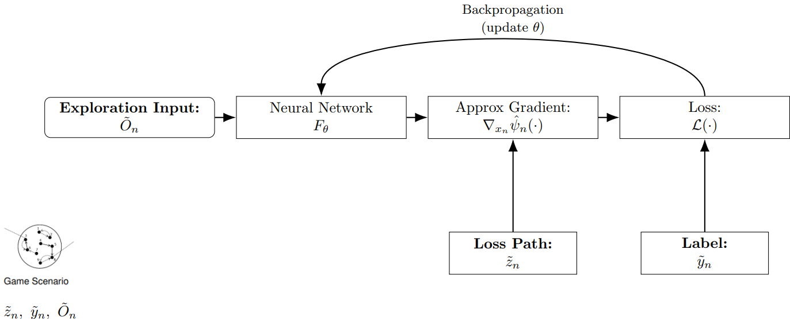
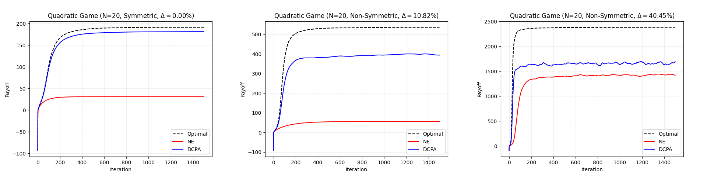
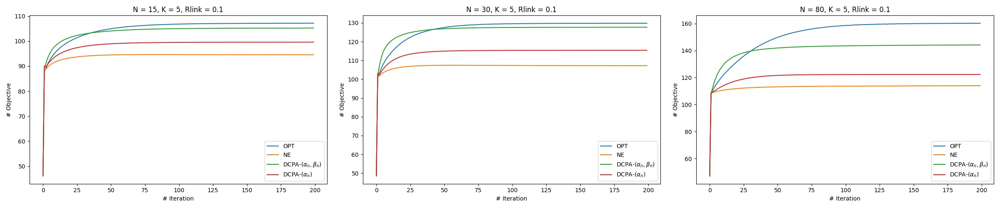
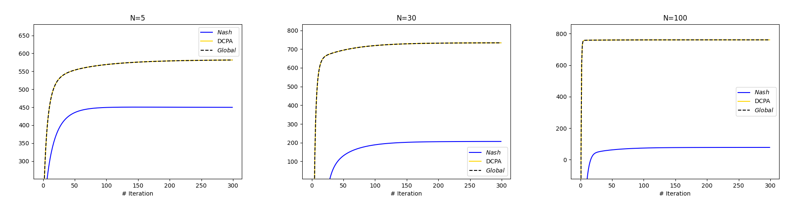
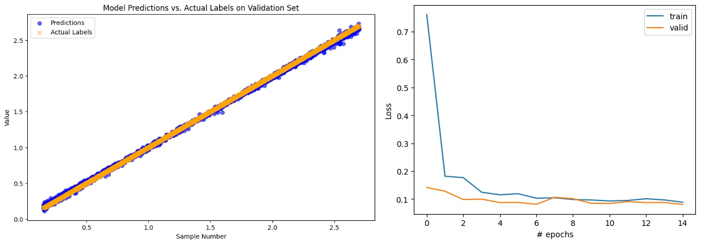

<h1 align="center">Up Your Game</h1>
<h3 align="center">Data-Driven Utility Design for Games with Efficient Nash Equilibria</h3>

<p align="center">
  <a href="https://www.python.org/"></a>
  <a href="https://pytorch.org/"></a>
  <a href="https://choosealicense.com/licenses/mit/"></a>
</p>

<p align="center">
  <b>Ariel Kantorovich &amp; Ilai Bistritz</b><br>
  RACCOON Lab, Tel Aviv University
</p>

<p align="center">
  <a href="https://ieeexplore.ieee.org/document/11312175"><b>CDC 2025 Paper</b></a>
  &nbsp;&bull;&nbsp;
  <a href="https://drive.google.com/drive/folders/1XrniNQHrXPZXyKWb8XiKFAH_CBNt9Lzd?usp=sharing"><b>Pre-trained Weights</b></a>
</p>

---

## Overview

This repository contains the official code for the paper **"Up Your Game: Data-Driven Utility Design for Games with Efficient Nash Equilibria"**, submitted to IEEE Transactions on Control of Networked Systems (TCNS). A preliminary conference version appeared at the 64th IEEE Conference on Decision and Control (CDC), 2025 [[IEEE]](https://ieeexplore.ieee.org/document/11312175).

We propose a **two-phase framework** -- an offline training stage and an online inference stage -- that uses deep learning to steer distributed game dynamics toward efficient Nash equilibria, without requiring global information at runtime.

**Key contributions of the extended TCNS version:**
- Added the case study of **quadratic games**.
- Proved that a good approximation of the global gradients yields a **close-to-optimal NE** of the designed game.
- Extended simulation results demonstrating **scalability** as the number of players increases.

<p align="center">
  
</p>

### Method

| Phase | Description |
|-------|-------------|
| **Offline** | Generate game instances, run exploration, and train a neural network (DCPA) to predict game parameters from local observations. |
| **Online** | Each player uses the trained NN to approximate the global gradient from local information, then applies gradient ascent toward an efficient NE. |

Three gradient modes are compared in every simulation:

| Mode | Symbol | Description |
|------|--------|-------------|
| **Nash (NE)** | Selfish | Each player follows its own gradient -- no coordination. |
| **DCPA (Ours)** | NN-assisted | Players use the trained NN to approximate the optimal gradient. |
| **Global (Oracle)** | Full info | Players use the true global gradient -- upper bound on performance. |

---

## Results

<details open>
<summary><b>Quadratic Games</b></summary>
<p align="center">
  
</p>
</details>

<details open>
<summary><b>Wireless Network Games</b></summary>
<p align="center">
  
</p>
</details>

<details open>
<summary><b>Energy Consumption Games</b></summary>
<p align="center">
  
</p>
</details>

<details>
<summary><b>Offline Training Stage</b></summary>
<p align="center">
  
</p>
</details>

---

## Repository Structure

```
UpYourGame/
├── QuadraticGames/              # Quadratic game module
│   ├── Quadratic_sim.py         #   Main simulation (NE vs Optimal vs DCPA)
│   ├── build_data_to_train.py   #   Generate training data
│   ├── Offline_train.py         #   Train the DCPA neural network
│   ├── configs/                 #   Example YAML training configs
│   ├── utils/                   #   Game math, data structures, plotting
│   └── dnn_utils/               #   NN architecture, training loops, datasets
│
├── Wireless_K/                  # Wireless network game module
│   ├── Wireless_naive_K.py      #   Main simulation (NE vs Optimal vs DCPA)
│   ├── buildDataToTrain.py      #   Generate training data
│   ├── Offline_train.py         #   Train the DCPA neural network
│   ├── gap_N.py                 #   NE-vs-Optimal gap as N grows
│   ├── configs/                 #   Example YAML training configs
│   ├── common/                  #   Channel models, data structures, plotting
│   └── DNN_common/              #   NN architecture, training loops, datasets
│
├── EnergyGame/                  # Energy consumption game module
│   ├── Energy_sim.py            #   Main simulation (NE vs Optimal vs DCPA)
│   ├── build_data_to_train.py   #   Generate training data
│   ├── common/                  #   Game math, data structures, plotting
│   └── dnn_utils/               #   NN architecture, Nash filters
│
├── Online_Stage/                # Pre-trained weights & normalisation stats
│   ├── Weights/                 #   .pth model checkpoints
│   └── hyperparameters/         #   Mean/std normalisation arrays
│
├── Offline_Stage/               # Jupyter notebooks for offline training
│   ├── ML_train_energyPath_game.ipynb
│   ├── ML_train_quadraticPath.ipynb
│   └── ML_WirelessPath.ipynb
│
├── Figures/                     # Result figures used in the paper
├── requirements.txt
├── README.md
└── LICENSE
```

---

## Prerequisites

| Requirement | Version |
|-------------|---------|
| Python | >= 3.8 (tested on 3.10) |
| CUDA | >= 11.8 (optional, tested on 12.4) |
| GPU | NVIDIA GPU recommended (tested on RTX 4090) |

> **Note:** CUDA is optional. All simulations can run on CPU, though training is significantly faster with a GPU.

---

## Installation

```bash
# Clone the repository
git clone https://github.com/arielkantorovich/UpYourGame.git
cd UpYourGame

# Create a virtual environment (conda or venv)
conda create -n upyourgame python=3.10 -y
conda activate upyourgame

# Install PyTorch (choose the command matching your CUDA version)
# CUDA 12.4:
pip install torch torchvision --index-url https://download.pytorch.org/whl/cu124
# CPU only:
# pip install torch torchvision --index-url https://download.pytorch.org/whl/cpu

# Install remaining dependencies
pip install -r requirements.txt
```

### Download Pre-trained Weights

Download the pre-trained weights from [**Google Drive**](https://drive.google.com/drive/folders/1XrniNQHrXPZXyKWb8XiKFAH_CBNt9Lzd?usp=sharing) and place them in `Online_Stage/Weights/`.

---

## Quick Start

Run a simulation for each game type with a single command:

```bash
# Quadratic Game (N=5 players, 800 games, with plot)
python QuadraticGames/Quadratic_sim.py --N 5 --L 800 --plot

# Wireless Network Game (N=5 players, K=14 channels, with plot)
python Wireless_K/Wireless_naive_K.py --N 5 --K 14 --plot

# Energy Consumption Game (N=5 players, with DCPA, with plot)
python EnergyGame/Energy_sim.py --N 5 --L 100 \
    --model_path "Energy_NetPath(N=5).pth" \
    --hyper_path "N=5_energey_game_uniform" \
    --plot
```

---

## Detailed Usage

Each game module supports three stages: **simulation**, **data generation**, and **training**.

### Quadratic Games

<details open>
<summary><b>Simulation</b></summary>

```bash
# Basic: NE vs Optimal only (debug mode)
python QuadraticGames/Quadratic_sim.py --N 5 --L 800 --T 1000 --plot --debug

# Full: NE vs Optimal vs DCPA (requires trained weights)
python QuadraticGames/Quadratic_sim.py --N 5 --L 800 --T 1000 --lr 0.01 \
    --weights path/to/trained_results_folder --plot --plot_std

# Non-symmetric game
python QuadraticGames/Quadratic_sim.py --N 20 --L 800 --non_symmetric --plot
```

**Key arguments:**

| Argument | Description | Default |
|----------|-------------|---------|
| `--N` | Number of players | 5 |
| `--L` | Number of game instances | 800 |
| `--T` | Gradient descent iterations | 1000 |
| `--lr` | Learning rate | 0.01 |
| `--alpha` | Distance-decay parameter for Q | 1.0 |
| `--non_symmetric` | Break Q symmetry with noise | False |
| `--weights` | Path to trained model folder | None |
| `--plot` | Show result plots | False |
| `--plot_std` | Show std deviation bands | False |
| `--debug` | Skip DCPA (NE + Optimal only) | False |

</details>

<details>
<summary><b>Data Generation (Offline)</b></summary>

```bash
# Generate training data (4000 games, shards of 500)
python QuadraticGames/build_data_to_train.py \
    --N 5 --L 4000 --L_batch 500 \
    --T_exploration 200 --T_loss 200

# Generate validation data
python QuadraticGames/build_data_to_train.py \
    --N 5 --L 800 --valid_L 800 --L_batch 200
```

**Key arguments:**

| Argument | Description | Default |
|----------|-------------|---------|
| `--N` | Number of players | 5 |
| `--L` | Number of training games | 4000 |
| `--valid_L` | Number of validation games | 800 |
| `--L_batch` | Games per shard file | 500 |
| `--T_exploration` | Exploration time steps | 200 |
| `--T_loss` | Loss-path trajectory length | 200 |
| `--base_dir` | Output directory | `Training_Data` |
| `--non_symmetric` | Generate non-symmetric games | False |

</details>

<details>
<summary><b>Training (Offline)</b></summary>

```bash
# Train the DCPA neural network
python QuadraticGames/Offline_train.py \
    --config QuadraticGames/configs/train_example.yaml \
    --input_dir QuadraticGames/Training_Data/N5 \
    --output_dir results/quadratic_N5
```

See [`QuadraticGames/configs/train_example.yaml`](QuadraticGames/configs/train_example.yaml) for all configurable training hyperparameters.

</details>

---

### Wireless Network Games

<details open>
<summary><b>Simulation</b></summary>

```bash
# Basic: NE vs Optimal only
python Wireless_K/Wireless_naive_K.py --N 5 --K 14 --Rlink 0.1 --T 2000 --plot --debug

# Full: NE vs Optimal vs DCPA (requires trained weights)
python Wireless_K/Wireless_naive_K.py --N 5 --K 14 --Rlink 0.1 --T 2000 \
    --train_path path/to/trained_results --plot

# Sweep NE-vs-Optimal gap across player counts
python Wireless_K/gap_N.py --K 14 --plot
```

**Key arguments:**

| Argument | Description | Default |
|----------|-------------|---------|
| `--N` | Number of players | 5 |
| `--K` | Number of frequency channels | 14 |
| `--Rlink` | Communication link radius | 0.1 |
| `--T` | Gradient descent iterations | 2000 |
| `--dist` | Channel gain distribution (`uniform`/`normal`) | `uniform` |
| `--lr_c` | Learning rate coefficient | 0.002 |
| `--p_max` | Maximum transmit power | 3.0 |
| `--train_path` | Path to trained model folder | None |
| `--plot` | Show result plots | False |
| `--debug` | Skip DCPA (NE + Optimal only) | False |

</details>

<details>
<summary><b>Data Generation (Offline)</b></summary>

```bash
# Generate training data
python Wireless_K/buildDataToTrain.py --N 5 --K 14 --L 5000 --T 2000 --save_train

# Generate validation data
python Wireless_K/buildDataToTrain.py --N 5 --K 14 --L 1000 --T 2000 --save_train --valid
```

</details>

<details>
<summary><b>Training (Offline)</b></summary>

```bash
# Train the DCPA neural network
python Wireless_K/Offline_train.py \
    --config Wireless_K/configs/train_example.yaml \
    --input_dir Wireless_K/Training_Data/N5_K14 \
    --output_dir results/wireless_N5_K14
```

See [`Wireless_K/configs/train_example.yaml`](Wireless_K/configs/train_example.yaml) for all configurable training hyperparameters.

</details>

---

### Energy Consumption Games

<details open>
<summary><b>Simulation</b></summary>

```bash
# Full: NE vs Optimal vs DCPA (requires pre-trained weights in Online_Stage/Weights/)
python EnergyGame/Energy_sim.py --N 5 --L 100 --K 24 --T 300 \
    --model_path "Energy_NetPath(N=5).pth" \
    --hyper_path "N=5_energey_game_uniform" \
    --plot

# With exponential distribution (N=7)
python EnergyGame/Energy_sim.py --N 7 --L 100 --dist exponential \
    --model_path "Energy_NetPath(N=7_exponential).pth" \
    --hyper_path "N=7_energey_game_exponential" \
    --plot

# Debug mode (NE + Global only, no NN required)
python EnergyGame/Energy_sim.py --N 5 --L 100 --plot --debug
```

**Key arguments:**

| Argument | Description | Default |
|----------|-------------|---------|
| `--N` | Number of players | 5 |
| `--L` | Number of game instances | 100 |
| `--K` | Number of resources (e.g. hours) | 24 |
| `--T` | Gradient ascent iterations | 300 |
| `--dist` | Distribution (`uniform`/`exponential`) | `uniform` |
| `--model_path` | Filename of `.pth` weights | None |
| `--hyper_path` | Normalisation stats folder name | None |
| `--plot` | Show result plots | False |
| `--debug` | Skip DCPA (NE + Global only) | False |

</details>

<details>
<summary><b>Data Generation (Offline)</b></summary>

```bash
# Generate training data (30 000 games, uniform distribution)
python EnergyGame/build_data_to_train.py --N 5 --K 24 --dist 0 --isValid 0

# Generate validation data (3 000 games)
python EnergyGame/build_data_to_train.py --N 5 --K 24 --dist 0 --isValid 1

# Exponential distribution
python EnergyGame/build_data_to_train.py --N 7 --K 24 --dist 1 --isValid 0
```

</details>

<details>
<summary><b>Training (Offline)</b></summary>

Training is done via the Jupyter notebook:
```bash
jupyter notebook Offline_Stage/ML_train_energyPath_game.ipynb
```

</details>

---

## Training Configuration (YAML)

Both `QuadraticGames/Offline_train.py` and `Wireless_K/Offline_train.py` accept a YAML configuration file for training hyperparameters:

| Field | Type | Default | Description |
|-------|------|---------|-------------|
| `optimizer` | str | `"adam"` | `"adam"` or `"sgd"` |
| `lr` | float | `0.001` | Learning rate |
| `weight_decay` | float | `0.0` | L2 regularisation |
| `criterion` | str | `"mse"` | `"mse"` or `"dcpa"` |
| `batch_size` | int | `128` | Mini-batch size |
| `epochs` | int | `100` | Number of training epochs |
| `grad_clip` | float | `null` | Max gradient norm (null = disabled) |
| `scheduler` | str | `"none"` | `"none"`, `"step"`, or `"cosine"` |

Example configs: [`QuadraticGames/configs/train_example.yaml`](QuadraticGames/configs/train_example.yaml), [`Wireless_K/configs/train_example.yaml`](Wireless_K/configs/train_example.yaml).

---

## Citation

If you find this work useful, please cite our papers:

```bibtex
@article{kantorovich2025upyourgame,
  title   = {Up Your Game: Data-Driven Utility Design for Games with Efficient Nash Equilibria},
  author  = {Kantorovich, Ariel and Bistritz, Ilai},
  journal = {IEEE Transactions on Control of Networked Systems},
  year    = {2025},
  note    = {Under review}
}

@inproceedings{kantorovich2025cdc,
  title     = {Up Your Game: Training Games with Efficient Nash Equilibrium with Deep Learning},
  author    = {Kantorovich, Ariel and Bistritz, Ilai},
  booktitle = {64th IEEE Conference on Decision and Control (CDC)},
  year      = {2025},
  doi       = {10.1109/CDC56724.2025.11312175}
}
```

---

## Acknowledgements

This research was conducted at the [RACCOON Lab](https://sites.google.com/view/ilaibistritz/raccoon-lab), Tel Aviv University, under the supervision of Dr. Ilai Bistritz.

---

## License

This project is licensed under the [MIT License](https://choosealicense.com/licenses/mit/).
